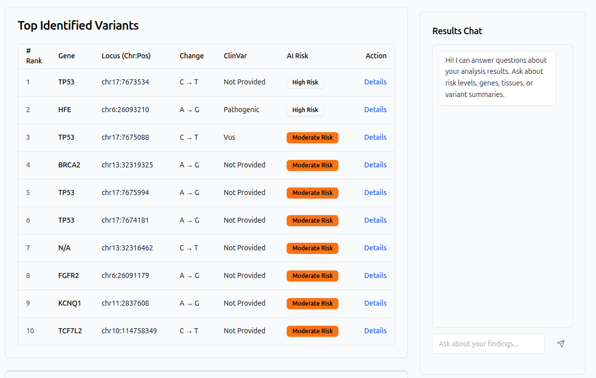

# Patient Genome Portal

Patient-facing web application for uploading consumer DNA data, running an automated analysis pipeline, and reviewing ranked variant results with AI-assisted explanations, a clinical-style summary report, and a grounded results chat.

## Preview

**Results dashboard** — variant table, clinical summary, and results chat:



**DNA animation** — reference asset used for branding and UI motion (MP4):

<video src="app/assets/13549104_3840_2160_25fps.mp4" width="100%" controls muted>
  Your browser does not support embedded video. The file is available at
  <a href="app/assets/13549104_3840_2160_25fps.mp4">app/assets/13549104_3840_2160_25fps.mp4</a>.
</video>


## Features

- **Upload** — DNA files (e.g. 23andMe-style text, VCF, comma-separated exports) to object storage.
- **Analysis pipeline** — asynchronous job processing with progress tracking (SSE).
- **Variant scoring** — AlphaGenome-based scoring with ClinVar enrichment (MyVariant.info).
- **Ranking and reporting** — Top variants ranked; Google Gemini generates per-variant summaries and an overall patient report (with retries and model fallback for transient API limits).
- **Dashboard** — Paginated results, risk context, detail views with track visualizations.
- **Results chat** — Questions answered from stored report and variant context (not a substitute for clinical advice).
- **Authentication** — JWT-based access for API routes as implemented in the application.

## Architecture

1. **API** — FastAPI (`app/main.py`) exposes REST endpoints under the configured router prefix.
2. **Queue** — ARQ worker (`app/worker.py`) consumes jobs from Redis and runs the LangGraph pipeline.
3. **Pipeline** — LangGraph graph (`app/graph/pipeline.py`): parse → enrich (ClinVar) → score (AlphaGenome) → rank → explain (Gemini).
4. **Persistence** — PostgreSQL (SQLModel) for jobs, files metadata, and variant results; Supabase Storage for raw uploads.
5. **Frontend** — React, TypeScript, Vite; dev server proxies `/api` to the backend.

## Requirements

- Python 3.13+
- [uv](https://github.com/astral-sh/uv) (recommended) or compatible tooling
- Node.js 20+ (for the frontend)
- PostgreSQL (compatible with async SQLAlchemy URL in settings)
- Redis (for ARQ)
- API keys: AlphaGenome, Google Gemini (Generative AI)
- Supabase project with storage bucket for uploads (service role key on the server only)

## Configuration

Create a `.env` file in the project root. The application loads it via `pydantic-settings` (see `app/config.py`). Typical variables include:

| Variable | Purpose |
|----------|---------|
| `ALPHAGENOME_API_KEY` | AlphaGenome API access |
| `GEMINI_API_KEY` | Google Gemini for explanations, report, and chat |
| `DATABASE_URL` | Async PostgreSQL URL (e.g. `postgresql+asyncpg://...`) |
| `REDIS_URL` | Redis for ARQ (default `redis://localhost:6379/0`) |
| `SUPABASE_URL` | Supabase project URL |
| `SUPABASE_SERVICE_KEY` | Service role key (backend only; never expose to the browser) |
| `SUPABASE_BUCKET_NAME` | Storage bucket for DNA files (default `dna-files`) |
| `JWT_SECRET_KEY` | Strong secret in production |
| `ALLOWED_ORIGINS` | CORS origins (JSON list or as supported by your deployment) |

Optional: `SENTRY_DSN` for error reporting.

## Run locally

**1. Backend and worker**

From the repository root, install dependencies and start the API plus ARQ worker:

```bash
uv sync
./app/run.sh dev
```

This starts the ARQ worker in the background and Uvicorn on port **8000** (see `app/run.sh`). The API serves `/health` for a quick check.

**Note:** Code changes to the worker are not reloaded by Uvicorn alone. After modifying worker or graph code, restart the ARQ process (or restart `./app/run.sh dev`) so jobs use the latest code.

**2. Frontend**

```bash
cd frontend
npm install
npm run dev
```

The Vite dev server runs on port **3000** and proxies `/api` to `http://localhost:8000`.

**3. Infrastructure**

Ensure PostgreSQL and Redis are running and match `DATABASE_URL` and `REDIS_URL`. Apply migrations if your deployment uses Alembic.

## API documentation

With `debug=true` in settings, OpenAPI docs are available at `/docs` and `/redoc`.

## Project layout

| Path | Description |
|------|-------------|
| `app/` | FastAPI application, config, security, services |
| `app/graph/` | LangGraph pipeline and node implementations |
| `app/worker.py` | ARQ task entrypoint |
| `app/assets/` | Static media (e.g. result preview screenshot, DNA animation MP4) |
| `frontend/` | React SPA |

## Development

- **Linting (Python):** `uv run ruff check .` (see `pyproject.toml`)
- **Tests:** `uv run pytest` (with dev extras installed)

## Disclaimer

This software is for research and educational use. Outputs are informational and not medical diagnoses or treatment recommendations. Users should consult licensed genetic counselors and physicians for clinical decisions.


